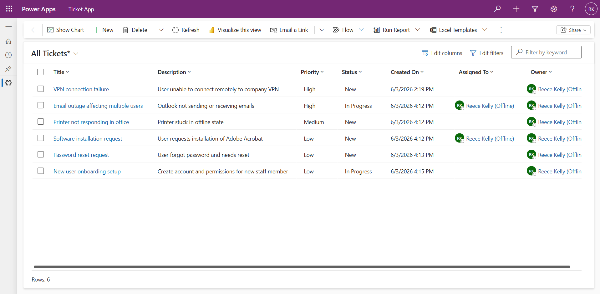
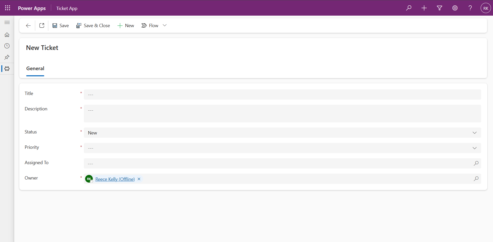
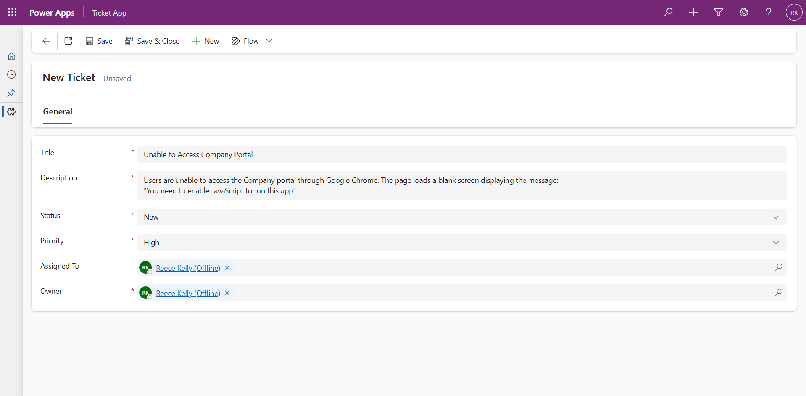
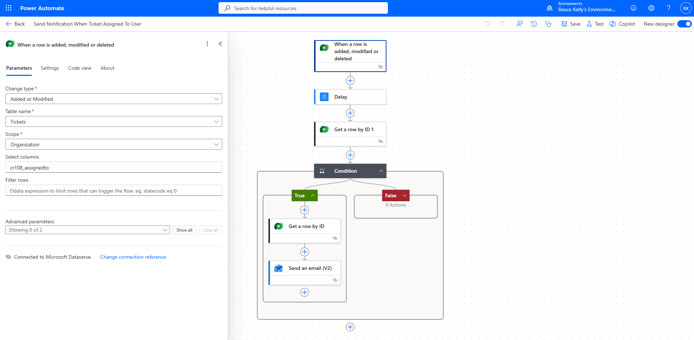
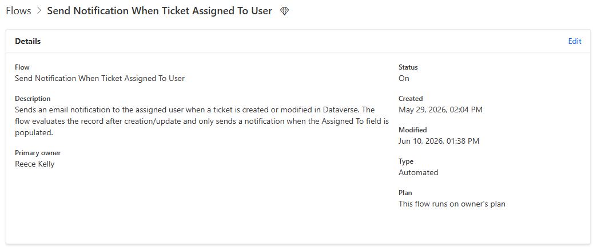

# Power-Apps-Ticketing-App

This repository contains the documentation for a ticketing app created with Microsoft Power Apps. The ticketing system is a model-driven app. Power Automate is also utilised within the solution for both email notifications of ticket assignments and automated updates to data as a ticket progresses from new to completed.

## Overview

The app allows users to:

- Create tickets for issues and work that needs to be completed.
- Change the status of the ticket as it is worked on and resolved.
- Assign tickets to users within the environment so they can work on them.

The Power Automate flows for the app:

- Send emails to users when they are assigned a new ticket.

## Features

- Ticket creation and management
- Ticket assignment to users
- Status lifecycle tracking
- Automated email notifications
- Business rule validation
- Model-driven Power Apps interface
- Dataverse-backed data storage
- Power Automate workflow integration
- Multiple views

## Screenshots

All Tickets View

Creating a New Ticket

Power Automate - Automated Cloud Flow

## Tech Stack

- Microsoft Power Apps
- Microsoft Dataverse
- Microsoft Power Automate
- Model-Driven App Architecture
